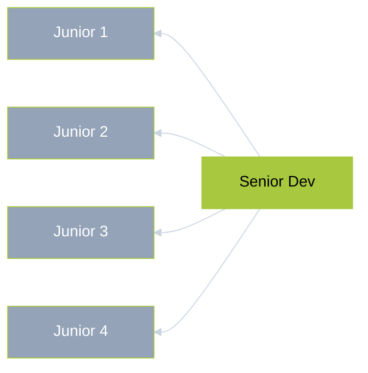
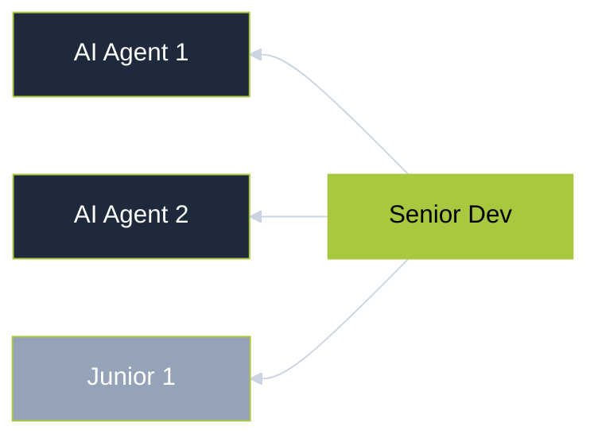

# The Three Waves of Building Software

Vibe Coding: Building Software in the Age of AI

Lecture 1

<!--
Welcome to the first session of the Vibe Coding course. Today we trace the entire arc of how software gets built — from hand-written code decades ago, through drag-and-drop platforms, to today's AI tools that let you describe what you want in plain English. By the end you'll have a shared vocabulary and mental model for the rest of the course.
-->

---
layout: default
---

# What You'll Learn

  
 

How We Got Here

From hand-written code to drag-and-drop builders to AI that writes entire apps

  
 

Two Kinds of AI Tools

Coding assistants that augment developers vs app builders that let anyone ship

  
 

Vibes vs Engineering

The behaviors that create debt and the disciplines that prevent it

  
 

What This Means for You

How AI is reshaping teams, careers, and where the opportunity is

<!--
Four threads run through today's session. First, we'll trace how software development evolved across three waves — each one opening the door wider while introducing new risks. Then we'll zoom into Wave 3 and distinguish the two camps: AI coding assistants for developers versus AI app builders for everyone. Third, we'll look at what goes wrong when you use these tools on autopilot — the vibe coding trap — and what disciplined usage looks like instead. Finally, we'll cover the real numbers: adoption data, team restructuring, career shifts, and where the opportunity is. We'll revisit these at the close.
-->

---
layout: statement
---

# Software development is the art of translating human intent into machine instructions

The gap between thinking in logic and writing syntax defines who can — and cannot — build.

<!--
Before we talk about waves, we need a shared baseline. Software development means writing instructions — source code — that a computer can execute. Source code is just text files. A compiler or interpreter translates those instructions into running software. The fundamental barrier has always been the gap between knowing what you want the computer to do and being able to express it in a programming language's syntax. That gap is what each wave tries to close.
-->

---
layout: section
---

# The Three Waves

From hand-written code to plain-English instructions

<!--
Let's start at the beginning. Software development has gone through three major waves, each lowering the barrier to who can build and what they can create.
-->

---
layout: default
class: green-slide
---

The Three Waves at a Glance

  

    1960s–2010s
    Wave 1
  

  
Traditional Coding

  <ul class="text-sm space-y-1 text-dark/60">
    <li>Developers write source code</li>
    <li>Full control and flexibility</li>
    <li>Steep learning curve</li>
    <li>Years to become proficient</li>
    <li>Only 0.3% can participate</li>
  </ul>

  

    2010s–2020s
    Wave 2
  

  
Low-Code / No-Code

  <ul class="text-sm space-y-1 text-dark/60">
    <li>Visual drag-and-drop builders</li>
    <li>Pre-built components and logic</li>
    <li>Faster for standard use cases</li>
    <li>Vendor lock-in tradeoff</li>
    <li>Customization hits a ceiling</li>
  </ul>

  

    2023–Present
    Wave 3
  

  
AI-Assisted Development

  <ul class="text-sm space-y-1 text-dark/60">
    <li>Natural language as interface</li>
    <li>AI generates entire codebases</li>
    <li>Copilots for developers</li>
    <li>Autonomous app builders</li>
    <li>Anyone can build software</li>
  </ul>

<!--
Here's the full timeline of all three waves. Notice how each wave progressively lowers the barrier to who can build software, while introducing new tradeoffs. Wave 3 splits into two distinct approaches — assistants for developers and vibe coding for everyone.
-->

---
layout: default
---

  

  

  

    
Wave 1

    <h1 class="text-4xl font-800 leading-tight">Traditional Coding</h1>
  

  

    
  

  

    
0.3%

    
of the global population can write production software

  

  

    

      
Hand-Written Code

      
Developers write every instruction manually in languages like Python, JavaScript, or Java.

    

    

      
Decades of Dominance

      
Still the backbone of all software today — full control, full flexibility, full complexity.

    

    

      
High Barrier

      
Years of learning required. Every business competes for a tiny talent pool.

    

    

      
Limited Reach

      
Only a fraction of the population can participate in building software.

    

  

<!--
Wave 1 is traditional hand-written code. For decades this was the only way software got built. Developers write every line manually in languages like Python, JavaScript, or Java. This gives complete control and flexibility, but the learning curve is steep — it takes years to become proficient. The result is that only about 0.3% of the global population can write production software. Every business that needs custom software competes for a tiny talent pool.
-->

---
layout: default
---

  

  

  

    
Wave 2

    
Low-Code / No-Code

  

  

    
  

  

    
10x

    
more people can build compared to Wave 1

  

  

    

      
Visual Builders

      
Drag-and-drop interfaces with pre-built components — Bubble, OutSystems, Retool, Power Platform.

    

    

      
Lower Barrier

      
Non-developers can build real internal tools and simple apps without writing code.

    

    

      
Vendor Lock-In

      
You're tied to the platform's ecosystem. If pricing changes or it shuts down, migration is painful.

    

    

      
Customization Ceiling

      
Great for standard use cases, but complex or highly custom applications quickly hit limits.

    

  

<!--
Wave 2 brought visual tools — drag and drop interfaces where you assemble applications from pre-built components. Platforms like Bubble, OutSystems, and Microsoft Power Platform lowered the barrier significantly. Non-developers can build real internal tools and simple apps. But there are clear constraints: you're locked into the platform's ecosystem, customization hits a ceiling, and if the vendor changes pricing or shuts down, migration is painful.
-->

---
layout: quote
---

# "English is the hottest programming language"

— Andrej Karpathy

<!--
Andrej Karpathy's statement captures the shift perfectly. Natural language is becoming the primary interface for building software. This has massive implications for who can participate in software creation. But — and this is where it gets nuanced — just talking to an AI is not enough.
-->

---
layout: section
---

# Wave 3: AI-Assisted Development

The biggest shift in how software gets built since the invention of programming itself

<!--
Wave 3 is fundamentally different from the first two waves. Instead of giving people better tools to write code or visual builders to avoid code, AI can now generate code from natural language. This wave splits into two camps: AI coding assistants that augment developers, and vibe coding tools that let anyone build software by describing what they want.
-->

---
layout: default
---

The Rise of AI Coding

  

  

    

    

      
2014–2021 — Niche AI Era

      
Kite, TabNine, GPT-3, Codex, Copilot

      
From early ML autocomplete to the first LLM-powered code generation. AI coding exists but stays niche.

    

  

  

    

    

      
2022 — LLM Chat

      
ChatGPT

      
Chat-based AI reaches 100M users. Developers write, explain, and debug code through conversation.

    

  

  

    

    

      
2023 — AI Coding Assistant

      
Claude, Cursor, v0

      
Multiple AI models and dedicated code editors launch. Competition drives rapid improvement.

    

  

  

    

    

      
2024 — AI App Builder

      
Bolt.new, Lovable, Replit Agent

      
Full-stack apps from prompts. Non-developers ship real products. Platforms hit $100M ARR in months.

    

  

  

    

    

      
2025+ — Vibe Coding

      
Claude Code, Copilot Agent Mode

      
"Vibe coding" enters the vocabulary. AI evolves from tools to autonomous coding agents.

    

  

<!--
The timeline of AI coding tools shows how fast this space has moved. From early ML autocomplete in 2014 to vibe coding platforms reaching $100M ARR in months — the pace of change is accelerating, not slowing down.
-->

---
layout: default
---

# Wave 3a: AI Coding Assistants

  
 Lives inside your code editor

  
 Suggests, completes, and generates code

  
 Developer stays in control

  
 Lowers effort, not the knowledge bar

  
 Chat, autocomplete, and inline edits

  
 Fits into existing workflows and git

  Tools:
  Cursor
  GitHub Copilot
  Claude Code

<!--
Wave 3 splits into two distinct categories. Wave 3a is AI coding assistants — tools like Cursor, GitHub Copilot, and Claude Code that live inside a developer's code editor. They suggest code completions, generate functions from comments, and help debug errors. Crucially, the developer is still in the driver's seat. They read every line, review the suggestions, and make the final decisions. These tools lower the effort for people who already know how to code, but they don't eliminate the need to understand code.
-->

---
layout: default
---

# Wave 3a: Tradeoffs

Advantages

Disadvantages

  
 Full Control

  
You own every line of code and can modify anything at any level of the stack.

  
 Requires Programming Knowledge

  
You still need to understand code to use these tools effectively.

  
 Any Tech Stack

  
Works with whatever languages, frameworks, and infrastructure you choose.

  
 Must Debug AI Output

  
AI suggestions aren't always correct — you need to read and verify every change.

  
 Handles Scale

  
Suited for large, complex codebases and production-grade applications.

  
 Steep Learning Curve

  
Non-developers can't just pick these up — coding fundamentals are a prerequisite.

  
 Developer Understands the Code

  
You can maintain, extend, and troubleshoot because you know what's happening.

  
 Subtle Bugs

  
AI can introduce hard-to-spot errors that require experience to catch.

<!--
The tradeoffs for AI coding assistants mirror traditional coding with a productivity boost. You keep full control and can use any technology, but you still need to know how to code. The AI accelerates your work but can also introduce subtle bugs that require experience to catch. It's a power tool for skilled builders, not an autopilot.
-->

---
layout: default
---

# Wave 3b: AI App Builder

  
 Describe what you want in plain English

  
 Tool builds the entire application

  
 No code editor, no programming needed

  
 Karpathy coined "vibe coding" (Feb 2025)

  
 Visual-first, prompt-driven workflow

  
 Deploy straight from the platform

  Tools:
  Bolt
  v0
  Replit Agent
  Lovable

<!--
Wave 3b is true vibe coding — the term Andrej Karpathy coined in February 2025. Tools like Bolt, v0, Replit Agent, and Lovable let you describe what you want in natural language, and the tool builds the entire application. There's no code editor, no terminal, no programming knowledge required. You focus on the vibes — what the product should look and feel like — and the AI handles all the code. This is a fundamentally different experience from AI coding assistants.
-->

---
layout: default
---

# Wave 3b: Tradeoffs

Advantages

Disadvantages

  
 No Coding Required

  
Anyone who can describe an idea can build a working app.

  
 Limited Customization

  
Hard to go beyond what the platform supports out of the box.

  
 Idea to Prototype in Minutes

  
Ship a working MVP faster than ever before.

  
 Hard to Debug

  
When things break, you can't read or fix the code yourself.

  
 Accessible to Everyone

  
Designers, PMs, and founders can build without a dev team.

  
 Vendor Lock-in

  
Your app lives on the platform — moving it elsewhere is painful.

  
 Great for MVPs

  
Perfect for validating ideas and simple internal tools.

  
 Doesn't Scale

  
Complex apps with custom logic quickly outgrow these tools.

<!--
True vibe coding dramatically lowers the barrier — anyone who can describe what they want can build software. The speed from idea to working prototype is remarkable. But the tradeoffs are real: customization is limited to what the tool supports, debugging is difficult when the AI produces broken output, you're locked into the platform, and complex or highly custom applications may exceed what these tools can handle. It's a spectrum — great for MVPs and simple tools, risky for complex production systems.
-->

---
layout: section
class: '!bg-[#C8644A]'
---

# Easy Start, Real Problems

Speed always comes with tradeoffs — know them before they find you.

<!--
Every tool that makes something faster also hides complexity somewhere. The easier it is to get started, the harder it can be to finish. Speed creates blind spots: you skip steps you don't understand, build on foundations you can't inspect, and accumulate debt you don't notice until it's too late. This isn't unique to AI — it's a universal pattern in technology. Let's look at the specific ways it shows up.
-->

---
layout: default
---

# Easy Start, Real Problems

  

    
 Hallucinated Code

    
Suggests things that don't exist — looks right, fails at runtime.

  

  

    
 Confidently Wrong

    
Plausible output with subtle errors that pass a quick glance.

  

  

    
 Context Amnesia

    
Forgets earlier decisions, contradicts its own architecture.

  

  

    
 Prototype Prison

    
10 minutes to build, 10 hours to make it production-ready.

  

  

    
 Feature Ceiling

    
Simple changes become impossible without understanding the code.

  

  

    
 Skill Atrophy

    
Auto-accepting erodes your ability to reason about what you build.

  

  

    
 Maintenance Trap

    
Can't iterate on code you don't understand.

  

  

    
 Breaks in the Wild

    
Works in preview, falls apart on real devices and edge cases.

  

---
layout: section
---

# The Vibe Coding Trap

<!--
We introduced vibe coding as a category of tools. But it's also a set of behaviors — patterns that feel productive but create the problems we just saw. Here's what vibe coding actually looks like in practice.
-->

---
layout: default
---

# The Vibe Coding Trap

 "Accept All"

You stop reading diffs — every AI suggestion gets accepted without review.

 Copy-Paste Debugging

Error message goes straight back to the AI with zero analysis.

 Prompt Until It Works

Bug won't fix? Ask for random changes until it disappears.

 Beyond Comprehension

The codebase grows past what you can explain or navigate.

 Skip the Fundamentals

Why learn how it works when AI can generate the answer?

 Ship the Demo

It works on screen — close enough. Testing can wait.

<!--
These behaviors come straight from Karpathy's original description of vibe coding — "you just see things, say things, run things, and copy paste things, and it mostly works." He described this as fine for throwaway weekend projects. The trap is when these habits carry over to real work. Each one maps to a problem from the previous slide: "Accept All" leads to hallucinated code shipping to production. Copy-paste debugging means you never understand the root cause. Prompting until it works creates fragile fixes. Beyond comprehension is how you end up in prototype prison. Recognizing these patterns is the first step — and the bridge to vibe engineering.
-->

---
layout: section
---

# From Vibes to Engineering

<!--
So if those are the vibe coding behaviors, what does the disciplined version look like? Let's talk about vibe engineering — using AI tools with intention, oversight, and craft.
-->

---
layout: default
---

# From Vibes to Engineering

 Disciplined Tooling

Combine Wave 3a + 3b tools — autocomplete and agents working together.

 Human Oversight

Review, test, and validate — never ship what you haven't verified.

 Architecture First

Plan before prompting — structure prevents prototype prison.

 Test Everything

Automated tests catch what quick glances miss.

 Own Your Code

Understand every line — if you can't explain it, don't ship it.

 Continuous Learning

Use AI to learn faster, not to skip learning entirely.

<!--
Vibe engineering flips every root cause into a discipline. Instead of blind trust, you have human oversight and testing. Instead of speed over structure, you plan your architecture before prompting. Instead of autopilot mode, you own your code and use AI to learn faster. Anthropic's own research found that only 0 to 20 percent of engineering tasks can be fully delegated to AI — the rest still requires your judgment, your review, your understanding. That's the difference between vibe coding and vibe engineering.
-->

---
layout: section
---

# The Landscape Today

<!--
Now that we understand the three waves, let's look at where things actually stand. The adoption numbers, the team changes, and the real-world results — both successes and failures.
-->

---
layout: default
class: green-slide
---

# By the Numbers

  

    
82%

    
of developers use AI tools weekly

  

  

    
60%

    
of work integrates AI assistance

  

  

    
3x

    
faster shipping for AI-proficient devs

  

  

    
~20%

    
drop in entry-level hiring since 2022

  

<!--
The numbers paint a clear picture of how fast adoption is moving. 82% of developers now use AI tools on a weekly basis. Engineers integrate AI into roughly 60% of their daily work. Developers proficient with AI tools ship approximately 3x faster than those who don't use them. And entry-level developer hiring has shifted down roughly 20% since 2022 — a trend we'll explore more when we talk about career implications.
-->

---
layout: default
class: green-slide
---

# AI at Enterprise Scale

<h3 class="font-bold text-lg mb-1">Google</h3>

25%+

of new code is AI-generated — engineers review and accept, velocity up ~10%

<h3 class="font-bold text-lg mb-1">Microsoft</h3>

20-30%

of internal codebases written entirely by AI — Satya Nadella, 2025

<h3 class="font-bold text-lg mb-1">Cursor</h3>

$1.2B

ARR in 17 months — fastest B2B SaaS to scale ever, built by ~20 engineers

<h3 class="font-bold text-lg mb-1">Y Combinator</h3>

95%

of code is AI-generated in 25% of W25 batch — "the age of vibe coding is here"

<!--
Google confirmed over 25% of new code is AI-generated. Microsoft's Satya Nadella revealed 20 to 30% of internal codebases are written entirely by AI. Cursor hit 1.2 billion in ARR in 17 months — the fastest B2B SaaS to scale in history, built by roughly 20 engineers. At Y Combinator, 25% of the Winter 2025 batch reported 95% of their code was AI-generated. Garry Tan called it the dominant way to code.
-->

---
layout: default
---

  

    
  

  

    <h1 class="text-3xl! leading-snug font-bold">"I think we will see the first one-person billion-dollar company — probably pretty soon"</h1>
    
— Sam Altman, CEO of OpenAI

  

<!--
Sam Altman predicted the first one-person billion-dollar company is coming soon. Dario Amodei, CEO of Anthropic, said it could happen by 2026. The tools now exist for a single person to build, launch, and scale products that once required entire teams.
-->

---
layout: default
class: green-slide
---

# Rise of the Solo Developer

<h3 class="font-bold text-lg mb-1">Base44</h3>

$80M

acquired by Wix in 6 months — solo founder Maor Shlomo, 250K users (TechCrunch)

<h3 class="font-bold text-lg mb-1">Pieter Levels</h3>

$3M+/yr

zero employees — PhotoAI, NomadList, RemoteOK built solo with Cursor + Claude

<h3 class="font-bold text-lg mb-1">Cal AI</h3>

5M+

downloads — 18-year-old founder, $30M projected revenue, started as 2-person team (CNBC)

<h3 class="font-bold text-lg mb-1">Formula Bot</h3>

$226K/mo

non-technical founder built on paternity leave with zero code — turned down Sequoia &amp; YC

<!--
The AI era is creating a new kind of founder. Base44 was built by a single developer who reached 250,000 users in six months and sold to Wix for 80 million dollars — covered by TechCrunch. Pieter Levels runs a portfolio earning over 3 million dollars a year with zero employees, all built with Cursor and Claude. An 18-year-old built Cal AI — a calorie tracking app with over 5 million downloads projecting 30 million in revenue, covered by CNBC. And David Bressler, a non-technical founder on paternity leave, built Formula Bot to 226,000 dollars a month with zero coding — and turned down offers from Sequoia Capital and Y Combinator. Sam Altman has a betting pool for the first one-person billion-dollar company. Dario Amodei predicted it would happen by 2026.
-->

---
layout: default
class: green-slide
---

  

  

  

    <h1 class="text-5xl font-800 leading-tight mb-6">The Paradox</h1>
    
AI is not eliminating developers — it is redefining what they do. The role is shifting from writing every line to directing, reviewing, and thinking in systems.

  

  
  

  

    

      
From Implementation to Direction

      
Engineers tell AI what to build and review what it produces — hands shift from keyboard to oversight.

    

    

      
From Syntax to Systems Thinking

      
Writing code matters less than understanding architecture, debugging AI output, and making judgment calls.

    

    

      
More Builders, Higher Stakes

      
Anyone can ship software now, but quality, security, and reliability still require human judgment that AI cannot replace.

    

  

<!--
Here's the paradox at the center of this shift: AI is not eliminating developers. It is redefining what developers do. Engineering roles are shifting from hands-on implementation toward agent direction — telling AI what to build and reviewing what it produces. From writing code line by line to reviewing AI-generated output critically. From syntax fluency to system-level thinking. People who understand both fundamentals and AI tools are in the highest demand.
-->

---
layout: section
---

# What This Means for You

<!--
Let's bring this home. What does all of this mean practically for you — whether you're a working professional, an aspiring developer, a founder, or a career-switcher?
-->

---
layout: default
---

  

  

  

    
Career Impact

    <h1 class="text-4xl font-800 leading-tight">The Accelerated Career Path</h1>
  

  

    
  

  

    
67%

    
drop in entry-level developer postings in some markets

  

  

    

      
Junior Hiring Declining

      
AI adoption cuts junior hiring 9-10% per six quarters — AI handles the routine work juniors used to do.

    

    

      
Senior Demand Holds

      
Senior hiring stays flat — experience, architecture skills, and judgment are still valued.

    

    

      
Compressed Ladder

      
The traditional career path — years on routine tasks before design work — is compressing fast.

    

    

      
New Opportunity

      
Juniors using AI see 35-39% speed gains vs. 8-16% for seniors — AI levels the playing field.

    

  

<!--
The career implications are real and measurable. Entry-level developer postings have dropped as much as 67% in some markets. Companies that adopt AI see junior hiring fall 9-10% within six quarters, while senior hiring stays flat. The traditional career ladder — spend years on routine tasks, gradually take on architecture and design — is compressing because AI now handles the routine work. This doesn't mean there's no path for new developers, but it means the path looks different.
-->

---
layout: default
---

# How Teams Are Restructuring

<h3 class="text-xl font-bold mb-2">Before AI</h3>

<h3 class="text-xl font-bold mb-2">After AI</h3>

<!--
The team structure shift is significant. Before AI tools, a typical product team had one or two senior developers overseeing four to five juniors. Juniors handled routine implementation — wiring up forms, writing CRUD endpoints, fixing straightforward bugs. Seniors focused on architecture, code review, and design decisions. With AI tools, companies are shrinking the junior layer because AI handles the routine work that juniors used to do. Senior developers now direct AI agents instead of mentoring large groups of juniors. The result is smaller, flatter teams with fewer entry-level positions.
-->

---
layout: fact
---

# 35-39%
speed-up for juniors using AI tools

vs. only 8-16% for senior developers

<!--
Here's the counterintuitive opportunity: junior developers using AI tools see 35-39% speed improvements, compared to only 8-16% for seniors. AI tools level the playing field more for less experienced developers. But — and this is critical — this only works if you treat AI as a learning tool, not a shortcut. If you blindly accept AI output without understanding it, you're building on sand. If you use AI to learn faster, review its reasoning, and build genuine understanding, you can compress years of growth into months.
-->

---
layout: default
---

# The Tools Will Change. The Skills Won't.

  
 How to evaluate tools critically

  
 How to direct AI effectively

  
 How to review output with judgment

  
 Principles over product-specific workflows

<!--
The AI coding landscape moves fast. Tools that dominate today may be overtaken in months. Pricing models shift. New capabilities appear constantly. This course teaches principles rather than workflows tied to any single product. How to evaluate tools, how to direct AI effectively, how to review output critically. The specific buttons will move; the judgment behind pressing them will not. That judgment is what we're building throughout this course.
-->

---
layout: default
---

# Key Takeaways

  
1

  
<strong>Three waves</strong> — hand-written code, low-code, AI-assisted

  
2

  
<strong>Wave 3 splits</strong> — assistants (3a) vs vibe coding (3b)

  
3

  
<strong>AI amplifies</strong> human judgment, doesn't replace it

  
4

  
<strong>Career paths</strong> are compressing — adapt early

  
5

  
<strong>Learn principles</strong>, not just today's tools

<!--
Let's revisit our learning objectives. You can now identify the three major waves: traditional coding, low-code/no-code, and AI-assisted development — which splits into coding assistants and true vibe coding. You understand the strengths and limitations of each. You see why fundamentals matter even as AI generates more code — because oversight, debugging, and system thinking can't be delegated. And you can distinguish between AI assistants that augment developers and vibe coding tools that let anyone build. These concepts form the foundation for everything we'll cover in the remaining sessions.
-->

---
layout: end
---

  
Next Session

  
Hands-On with AI Coding Tools

  
Questions?

<!--
In our next session, we'll move from concepts to practice. You'll get hands-on time with both AI coding assistants and vibe coding tools, building something real and experiencing the differences firsthand. See you then.
-->
